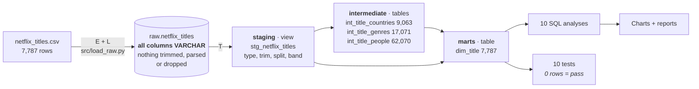
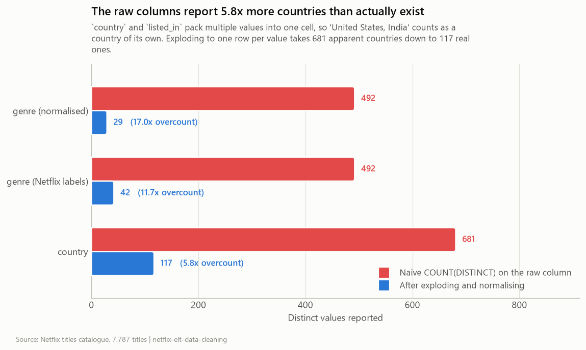
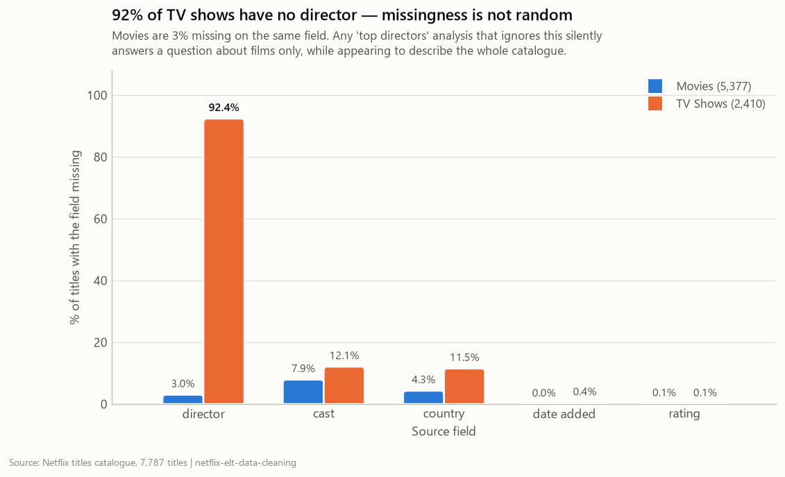
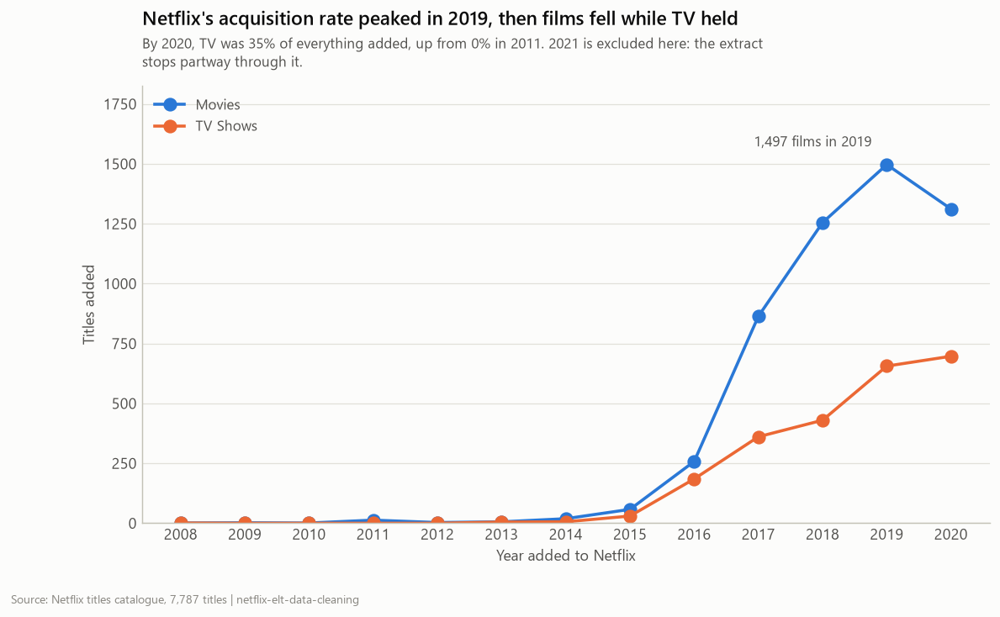
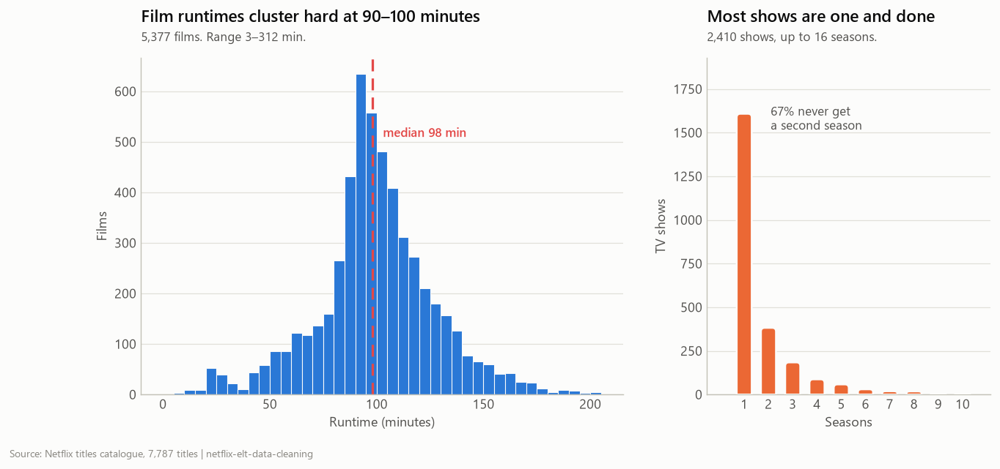
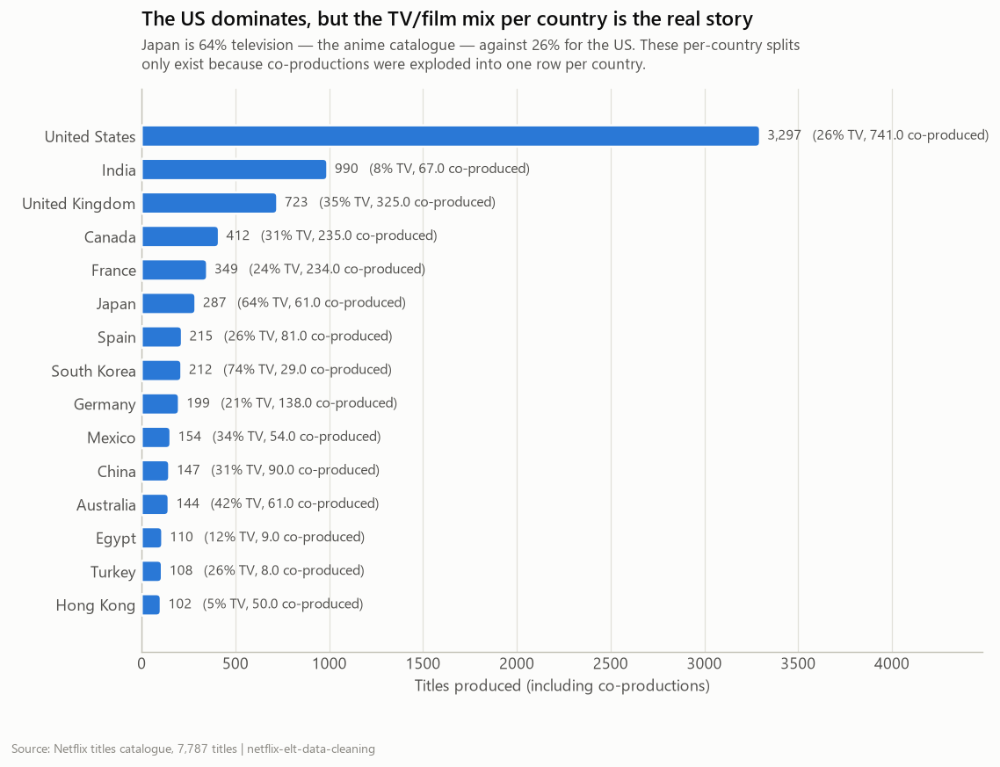

# Netflix Catalogue — ELT & Data Cleaning in SQL

[](https://www.python.org/)
[](https://duckdb.org/)
[](sql/)
[](sql/tests)
[](LICENSE)

A layered **ELT** over the Netflix titles catalogue: the CSV lands in the
warehouse untouched, and every cleaning decision is a reviewable SQL model with
a test behind it. Structured the way dbt structures a project — staging →
intermediate → marts — but implemented in ~120 lines of Python so the mechanics
are visible rather than hidden behind a framework.

> **The finding that justifies the whole project:** a naive
> `COUNT(DISTINCT country)` on this dataset returns **681 countries**. There are
> **117**. The `country` column packs up to 12 comma-separated values into one
> cell, so `'United States, India'` is counted as a country in its own right.
> The same defect inflates genres from 29 to 492.

---

## Contents

- [ELT, not ETL — and why it matters here](#elt-not-etl--and-why-it-matters-here)
- [The layers](#the-layers)
- [What was actually wrong with this data](#what-was-actually-wrong-with-this-data)
- [The test suite](#the-test-suite)
- [Findings](#findings)
- [Running it](#running-it)
- [Engineering decisions](#engineering-decisions)

---

## ELT, not ETL — and why it matters here



`src/load_raw.py` loads every column as `VARCHAR` with `all_varchar = true`.
That is deliberate: **type inference is a transformation**, and transformations
belong in a reviewable model, not in a CSV reader's heuristics. The raw table is
a faithful landing of the source, so when a cleaning rule turns out to be wrong
the fix is a SQL change and a 0.85-second re-run — the source of truth is
already in the warehouse.

This is the deliberate contrast with the sibling project
[nyc-taxi-etl-pipeline](https://github.com/Maheshushir/nyc-taxi-etl-pipeline),
where the transform happens *before* the load and the raw form is not retained.
Neither is better; they answer different questions. ELT wins when the source is
small, messy, and the cleaning rules are still being argued about — which is
exactly this dataset.

---

## The layers

| Layer | Materialisation | Why |
|---|---|---|
| `staging` | **view** | Cheap, always fresh, no storage. Keeps `raw` as the single source of truth. |
| `intermediate` | **table** | The `UNNEST` explodes are the expensive step; materialise once, reuse three times. |
| `marts` | **table** | What analysts and BI tools read. |

```
Built 5 models, 103,778 rows total, in 0.85s

[staging]  (view)
  stg_netflix_titles            7,787 rows    0.03s
[intermediate]  (table)
  int_title_countries           9,063 rows    0.08s
  int_title_genres             17,071 rows    0.10s
  int_title_people             62,070 rows    0.23s
[marts]  (table)
  dim_title                     7,787 rows    0.29s

[tests]  10 assertions
  10 passed, 0 failed
```

---

## What was actually wrong with this data

### 1. Multi-value cells (the big one)

`country`, `listed_in` and `cast` each pack a variable-length list into one
string — up to 12 countries, 3 genres and **50 cast members** per cell.



`int_title_countries` and friends explode these into proper bridge tables with
`UNNEST(STRING_SPLIT(...)) WITH ORDINALITY`, keeping the ordinal position —
because the first-listed country is conventionally the primary production
country, and that is information the raw string throws away.

Two traps the tests pin down: trailing commas (`'United States, '`) leave an
empty token after the split, and every token carries a leading space, so
`' India'` and `'India'` would count as two different countries.

### 2. One column, two units

`duration` holds `'93 min'` for films and `'4 Seasons'` for series. Left as
text it cannot be used for arithmetic; cast naively it puts 93 minutes and 4
seasons on the same axis. Staging splits it into `duration_minutes` and
`seasons`, and [`duration_units_split.sql`](sql/tests/duration_units_split.sql)
asserts that every row resolves to exactly one of them — never both, never
neither.

### 3. An engine-dependent date bug

88 `date_added` values carry a leading space (`' March 15, 2019'`).

DuckDB's `strptime` tolerates that. **pandas' `to_datetime` with the same format
string returns `NaT`.** So identical cleaning logic gives different answers
depending on which engine runs it — 88 rows silently vanish from the "titles
added per month" series in one and not the other. The `TRIM` is not redundant
defensive coding; it is what makes the result engine-independent, and
[`date_added_parsed.sql`](sql/tests/date_added_parsed.sql) pins the contract at
the value level so no future refactor can quietly drop it.

### 4. Genre labels that split every category in two

Netflix tags `'TV Dramas'` and `'Dramas'` separately, likewise
`'TV Comedies'`/`'Comedies'` and `'TV Horror'`/`'Horror Movies'`. Left alone,
every genre chart shows each category twice at half its real size.
`genre_normalised` collapses the format prefix — 42 Netflix labels become 29
genres — while `genre` keeps the verbatim label, because "what does Netflix call
this?" is still a legitimate question.

### 5. Missingness that is very much not random



| Field | Missing in Movies | Missing in TV Shows |
|---|---:|---:|
| director | 3.0% | **92.4%** |
| cast | 7.9% | 12.1% |
| country | 4.3% | 11.5% |
| rating | 0.1% | 0.1% |

Only **5.6%** of TV shows are complete on all five fields, against **86.9%** of
films. Any "top directors on Netflix" analysis that ignores this silently
answers a question about films only, while appearing to describe the whole
catalogue. `dim_title` carries the five `missing_*` booleans and a 0–5
`completeness_score` so this is a query rather than a forensic exercise.

---

## The test suite

Ten assertions in [`sql/tests/`](sql/tests). Each returns the **offending
rows**, so an empty result is a pass — the same convention dbt uses. The runner
fails the build if any test returns anything.

| Test | What it protects |
|---|---|
| `unique_show_id` | Grain of `dim_title` |
| `row_count_preserved` | Cleaning changes values, never the row count |
| `not_null_keys` | Columns every downstream model joins on |
| `duration_units_split` | Exactly one of minutes/seasons per row |
| `date_added_parsed` | The 88 leading-space rows keep parsing |
| `accepted_values_type` | `title_type` is a closed set |
| `accepted_values_audience` | A new rating code can't appear unmapped |
| `no_empty_tokens` | Explodes leave no empty or untrimmed values |
| `referential_integrity` | No bridge row points at a missing title |
| `release_year_plausible` | Years inside the range of filmed media |

Two of these caught real bugs while I was writing them: `not_null_keys` and
`referential_integrity` originally put `HAVING` after a `UNION ALL`, which binds
only to the final branch — so they were checking one column instead of four.
Both are now wrapped in a CTE.

---

## Findings

### Netflix's acquisition rate peaked in 2019



1,497 films were added in 2019 alone. Films fell in 2020 while TV held steady,
pushing TV to 34.7% of everything added.

### Runtime is remarkably standardised; TV is brutally unforgiving



Films cluster hard at a 98-minute median across a 3–312 minute range. On the
other side, **67% of TV shows never get a second season** — of 2,410 shows, only
a handful reach double digits.

### The country mix is a story about format, not volume



The US leads on raw count, but the interesting column is the TV share: Japan is
**64% television** — the anime catalogue — against 26% for the US. The UK
co-produces 325 of its 723 titles. None of these numbers are computable from the
raw column.

All ten result sets: [`outputs/results/ANALYSIS.md`](outputs/results/ANALYSIS.md)

---

## Running it

```bash
git clone https://github.com/Maheshushir/netflix-elt-data-cleaning.git
cd netflix-elt-data-cleaning
pip install -r requirements.txt

python src/load_raw.py     # E+L: land the CSV untouched
python src/run_elt.py      # T: build 5 models, then run 10 tests
python src/analyze.py      # 10 analysis queries → outputs/results/
python src/visualize.py    # → outputs/charts/
```

The whole thing runs in a couple of seconds. Useful variants:

```bash
python src/run_elt.py --test      # tests only, against the existing build
python src/run_elt.py --no-test   # build only
```

---

## Repo layout

```
netflix-elt-data-cleaning/
├── data/raw/netflix_titles.csv     # committed: 3 MB, keeps the repo reproducible
├── src/
│   ├── config.py                   # paths + layer ordering
│   ├── load_raw.py                 # E+L, all_varchar, zero cleaning
│   ├── run_elt.py                  # T: layered build + test runner
│   ├── analyze.py                  # runs sql/analysis/*.sql
│   └── visualize.py                # → outputs/charts/
├── sql/
│   ├── staging/                    # 1 view  — type, trim, split, band
│   ├── intermediate/               # 3 tables — the UNNEST bridges
│   ├── marts/                      # 1 table — dim_title
│   ├── tests/                      # 10 assertions
│   └── analysis/                   # 10 queries
└── outputs/
    ├── results/                    # 10 CSVs + ANALYSIS.md
    └── charts/                     # 5 PNGs
```

---

## Engineering decisions

**NULLs stay NULL.** 2,389 titles have no director. Filling that with
`'Unknown'` would make it a value — it would appear in `GROUP BY` output as the
most prolific director on Netflix. NULL propagates correctly through aggregates;
a sentinel string does not. The presentation layer decides how to display it.

**Both the raw and the normalised genre label are kept.** Replacing
`'TV Dramas'` with `'Dramas'` everywhere would destroy the ability to answer
"what does Netflix actually call this?". Normalisation is an additional column,
not a replacement.

**Ordinal position is preserved through the explode.** `WITH ORDINALITY` gives
`country_position` and `billing_position`, which is what makes "primary
production country" and "top-billed cast" expressible at all.

**The people bridge unions cast and directors.** The same human appears in both
roles, and one table with a `role` discriminator makes "who does Netflix work
with most?" a single `GROUP BY` instead of a union at query time.

**`cast` is quoted everywhere.** It is a reserved word in DuckDB and most other
dialects. Staging renames it to `cast_raw` immediately so nothing downstream has
to remember to quote it — which is exactly the kind of thing that otherwise
breaks a pipeline three layers away from the cause. (It broke this one once, in
`load_raw.py`, before the quoting went in.)

**Layer boundaries carry the dependency order.** No dependency graph, no DAG
parser: `staging` → `intermediate` → `marts`, alphabetical within a layer. It is
the simplest model that works, and it makes a circular dependency structurally
impossible rather than merely detectable.

### Where this would move to dbt

This project is a deliberate re-implementation of dbt's core ideas at small
scale. At real scale I would use dbt itself and get: a true dependency graph
from `ref()` rather than folder ordering, incremental models, snapshots for
slowly changing dimensions, generated documentation, and a much larger built-in
test library. The layer structure and the models would carry across almost
unchanged.

---

## Data source

[Netflix Movies and TV Shows](https://www.kaggle.com/datasets/shivamb/netflix-shows),
via the [TidyTuesday](https://github.com/rfordatascience/tidytuesday) mirror
(2021-04-20). 7,787 titles. Committed to `data/raw/` so the project reproduces
without a Kaggle account.

## License

MIT — see [LICENSE](LICENSE).
